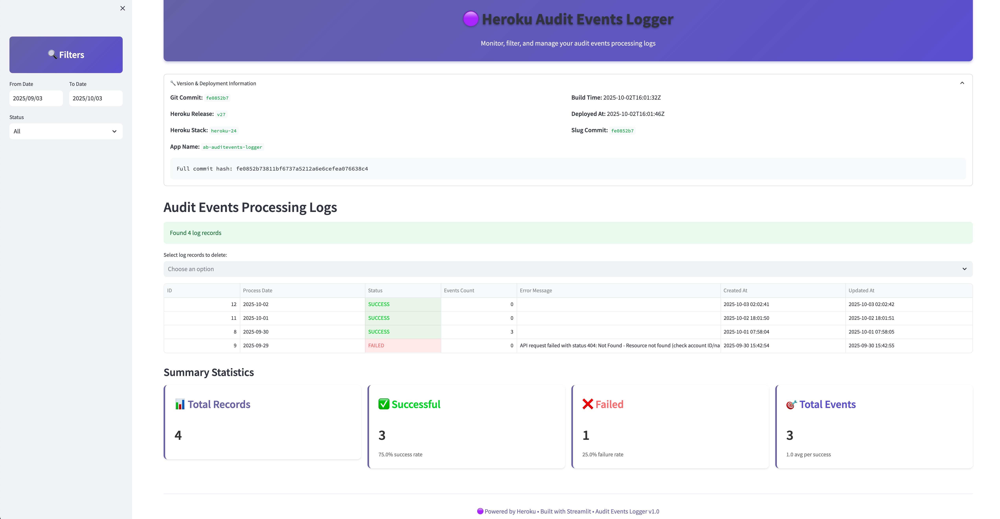

# Heroku Audit Events Logger

A Python application that runs on Heroku to retrieve and log audit trail events from the Heroku Platform API. It includes both a scheduled processing script and a web interface for monitoring and managing the processing logs.

## Features

- **Daily Processing**: Retrieves audit events from the previous day when triggered
- **Custom Date Processing**: Override date to retrieve audit events for any specific date
- **Web Interface**: Streamlit-based web UI for viewing and managing processing logs
- **Duplicate Prevention**: Checks if events for a date have already been processed
- **Concurrency Safety**: Atomic database locking prevents multiple processes from processing the same date
- **Database Logging**: Stores processing status and results in PostgreSQL
- **External Scheduling**: Designed to run via Heroku Scheduler addon
- **Error Handling**: Comprehensive error handling and logging
- **Flexible Execution**: Command-line script with optional date parameter
- **Stuck Process Cleanup**: Automatically cleans up stuck processing records



## Disclaimer

The author of this article makes any warranties about the completeness, reliability and accuracy of this information. **Any action you take upon the information of this website is strictly at your own risk**, and the author will not be liable for any losses and damages in connection with the use of the website and the information provided. **None of the items included in this repository form a part of the Heroku Services.**

## Setup

### 1. Environment Variables

Set the following environment variables in your Heroku app:

```bash
# Required: Heroku API Token
HEROKU_API_TOKEN=your_heroku_api_token_here

# Required: Heroku Account ID
HEROKU_ACCOUNT_ID=your_heroku_account_id_here

# Optional: Event filtering parameters
FILTER_TYPE=app
FILTER_ACTION=create
FILTER_ACTOR_EMAIL=user@example.com
```

The `DATABASE_URL` is automatically provided when you add the Heroku Postgres addon.

### 2. Getting Heroku API Credentials

#### API Token
1. Go to your Heroku account settings
2. Navigate to the "API Key" section
3. Generate a new API key or copy your existing one
4. Set it as the `HEROKU_API_TOKEN` environment variable

#### Account ID
1. Go to your Heroku account settings
2. Your Account ID is displayed in the "Account Information" section
3. Copy the Account ID and set it as the `HEROKU_ACCOUNT_ID` environment variable

Alternatively, you can get your Account ID using the Heroku CLI:
```bash
heroku api GET /enterprise-accounts/<YOUR_ACCOUNT_NAME_HERE>
```

### 3. Event Filtering (Optional)

The application supports filtering audit events by setting optional environment variables:

- **`FILTER_TYPE`**: Filter by event type (e.g., "app", "addon", "dyno")
- **`FILTER_ACTION`**: Filter by event action (e.g., "create", "update", "destroy")
- **`FILTER_ACTOR_EMAIL`**: Filter by actor email (email address of the user who performed the action)

If no filters are set, all events for the specified day will be retrieved.

### 4. Deploy to Heroku

```bash
# Initialize git repository (if not already done)
git init

# Add Heroku remote
heroku create your-app-name

# Add Heroku Postgres addon
heroku addons:create heroku-postgresql:mini

# Add Heroku Scheduler addon
heroku addons:create scheduler:standard

# Enable runtime dyno metadata (required for version information display)
heroku labs:enable runtime-dyno-metadata -a your-app-name

# Set environment variables
heroku config:set HEROKU_API_TOKEN=your_actual_token_here
heroku config:set HEROKU_ACCOUNT_ID=your_actual_account_id_here

# Deploy
git add .
git commit -m "Initial commit"
git push heroku main
```

**Note:** The `runtime-dyno-metadata` lab feature enables access to Heroku environment variables like `HEROKU_RELEASE_VERSION`, `HEROKU_RELEASE_CREATED_AT`, and `HEROKU_SLUG_COMMIT`, which are used by the web interface to display version information about the deployed code.

### 4. Configure Heroku Scheduler

After deployment, configure the Heroku Scheduler addon:

1. Go to your Heroku app dashboard
2. Click on the "Heroku Scheduler" addon
3. Create a new job with:
   - **Command**: `python app.py`
   - **Frequency**: Daily at your preferred time (e.g., 2:00 AM UTC)
   - **Dyno Size**: Basic or Standard (depending on your needs)

## Manual Execution

You can run the script manually for testing or one-off processing:

### Default Behavior (Previous Day)
```bash
# Run via Heroku CLI (processes previous day)
heroku run python app.py

# Or run locally (with proper environment variables set)
python app.py
```

### Custom Date Processing
You can specify a custom date to retrieve audit events for a specific date:

```bash
# Process audit events for a specific date
heroku run -- python app.py --date 2025-09-29

# Local execution with custom date
python app.py --date 2025-09-29

# Show help and available options
python app.py --help
```

**Date Format**: Use YYYY-MM-DD format for the `--date` parameter.

### Database Management Commands

The application includes one-off dyno commands for database management:

```bash
# Initialize database tables and indexes
heroku run db-init

# Clean up stuck processes
heroku run db-cleanup

# Show processing status
heroku run python db_manager.py status

# Reset processing for a specific date
heroku run python db_manager.py reset 2024-09-28
```

**Note**: The `db-init` and `db-cleanup` commands are defined in the Procfile as one-off dyno processes, making them easy to run via the Heroku CLI.

## Web Interface

The application includes a **Streamlit-based web interface** for viewing and managing audit events processing logs.

### Accessing the Web Interface

The web interface is automatically deployed and accessible at your Heroku app URL:

```
https://your-app-name.herokuapp.com/
```

### Features

- **View Processing Logs**: Display all audit events log records with processing status
- **Filter by Status**: Filter records by SUCCESS, FAILED, ERROR, or PROCESSING status  
- **Filter by Date Range**: Filter records by process date range
- **Delete Records**: Select and delete multiple log records
- **Color-coded Status**: Visual indicators for different processing statuses
- **Summary Statistics**: Overview of total records, successful days, failed days, and total events
- **Detailed View**: Expanded information for selected records
- **Version Information**: Expandable section showing deployment details including:
  - Git commit hash (short and full)
  - Heroku release version and deployment time
  - Build time and Heroku stack
  - App name and current dyno ID

### Interface Components

- **Version Information**: Expandable section with deployment and build details
- **Sidebar Filters**: Date range and status filtering options
- **Data Table**: Sortable table showing all log records with key information
- **Selection Interface**: Multi-select checkboxes for choosing records to delete
- **Action Buttons**: Delete selected records with confirmation
- **Statistics Dashboard**: Real-time summary of processing performance

The web interface provides an easy way to monitor the success/failure of your audit events collection process and manage historical processing records without needing to access the database directly.

### Version Information System

The web interface displays comprehensive version and deployment information through a two-part system:

#### Build-time Information
Captured during Heroku build process via `bin/post_compile` hook:
- **Git Commit Hash**: From `SOURCE_VERSION` environment variable
- **Build Time**: Timestamp when the build occurred
- **Heroku Stack**: The Heroku stack version used

#### Runtime Information  
Retrieved from Heroku dyno metadata (requires `runtime-dyno-metadata` lab feature):
- **Heroku Release Version**: Current release (e.g., "v25")
- **Deployment Time**: When the release was deployed
- **Slug Commit**: Git commit hash of the deployed slug
- **App Name**: Heroku application name
- **Dyno ID**: Unique identifier of the current dyno instance

This system provides complete traceability of what code is running and when it was deployed, essential for debugging and monitoring in production environments.

## Database Management

The application uses **SQLAlchemy ORM** and **Alembic** for database management, providing:

- **Object-Relational Mapping**: Clean, Pythonic database operations
- **Automatic Migrations**: Version-controlled database schema changes
- **Type Safety**: Strong typing for database operations
- **Connection Management**: Proper connection pooling and cleanup

### Database Schema

The application creates a single table to track processing status:

#### audit_events_log
Tracks the processing status for each date:

```python
class AuditEventsLog(Base):
    __tablename__ = 'audit_events_log'
    
    id = Column(Integer, primary_key=True, autoincrement=True)
    process_date = Column(Date, nullable=False, unique=True)
    status = Column(String(20), nullable=False)
    events_count = Column(Integer, default=0)
    error_message = Column(Text, nullable=True)
    created_at = Column(DateTime, default=datetime.utcnow)
    updated_at = Column(DateTime, default=datetime.utcnow, onupdate=datetime.utcnow)
```

**Note**: Individual audit events are not stored in the database. Instead, the application logs the required attributes (`created_at`, `actor`, `type`, `action`) for each event retrieved from the Heroku API.

### Database Indexes

The application automatically creates indexes to optimize query performance:

- **`idx_audit_events_log_status`**: Optimizes status-based queries (cleanup operations)
- **`idx_audit_events_log_process_date_status`**: Composite index for lock release operations

Note: The `process_date` column has a UNIQUE constraint which automatically creates an index.

### Database Migrations

The application uses Alembic for database migrations:

```bash
# Run migrations (automatically handled by the application)
alembic upgrade head

# Create a new migration
alembic revision --autogenerate -m "Description of changes"

# View migration history
alembic history

# Rollback to previous version
alembic downgrade -1
```

## Scheduling

The application is designed to run via the Heroku Scheduler addon. When triggered, it automatically processes audit events from the previous day. The script reads the current date and calculates the previous day's date for processing.

## Error Handling

The application handles various error scenarios:

- **API Authentication Errors**: Invalid or missing API token
- **Network Errors**: Connection timeouts or network issues
- **Database Errors**: Connection or query failures
- **Duplicate Processing**: Prevents processing the same date twice
- **Concurrent Execution**: Atomic database locking prevents race conditions
- **Stuck Processes**: Automatic cleanup of processes that didn't complete properly

## Logging

All operations are logged with appropriate log levels:
- `INFO`: Normal operations and successful processing
- `WARNING`: Non-critical issues (e.g., skipped scheduled job)
- `ERROR`: Failed operations and exceptions

## Monitoring

You can monitor the application through:

1. **Heroku Logs**: `heroku logs --tail`
2. **Heroku Scheduler**: Check job execution history in the Scheduler addon
3. **Database**: Query the `audit_events_log` table directly
4. **Manual Execution**: Run `heroku run python app.py` to test manually

## Development

To run locally:

```bash
# Install dependencies
pip install -r requirements.txt

# Set environment variables
export HEROKU_API_TOKEN=your_token_here
export HEROKU_ACCOUNT_ID_OR_NAME=your_account_id_or_name_here
export DATABASE_URL=your_local_postgres_url

# Run database migrations (if needed)
alembic upgrade head

# Run the application
python app.py
```

### Database Development

For database development and migrations:

```bash
# Create a new migration after model changes
alembic revision --autogenerate -m "Add new field to model"

# Apply migrations
alembic upgrade head

# Rollback migrations
alembic downgrade -1

# View migration history
alembic history --verbose
```

## Requirements

- Python 3.11.6
- Heroku API token with appropriate permissions
- Heroku Postgres database
- Internet connectivity for API calls
